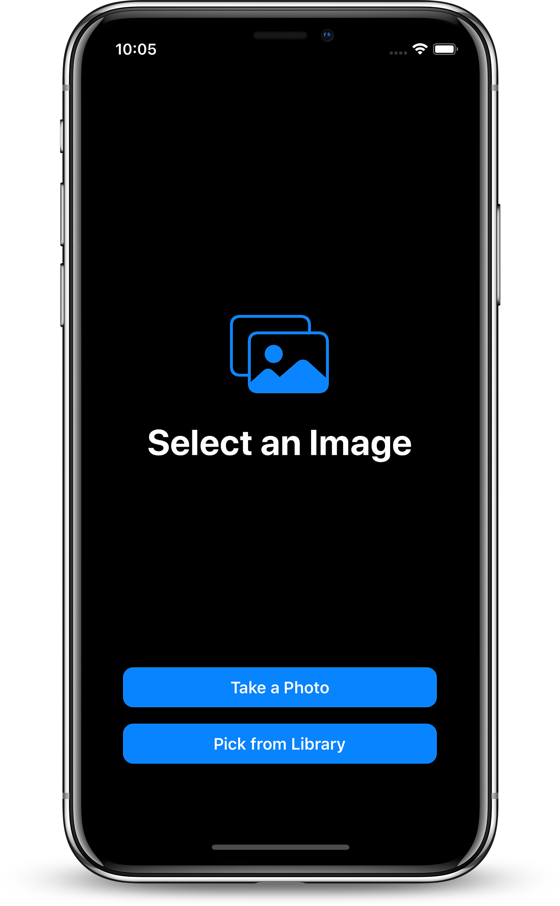
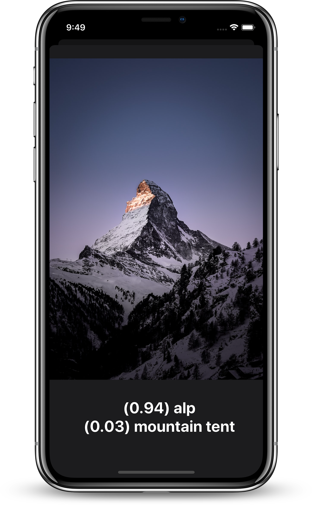
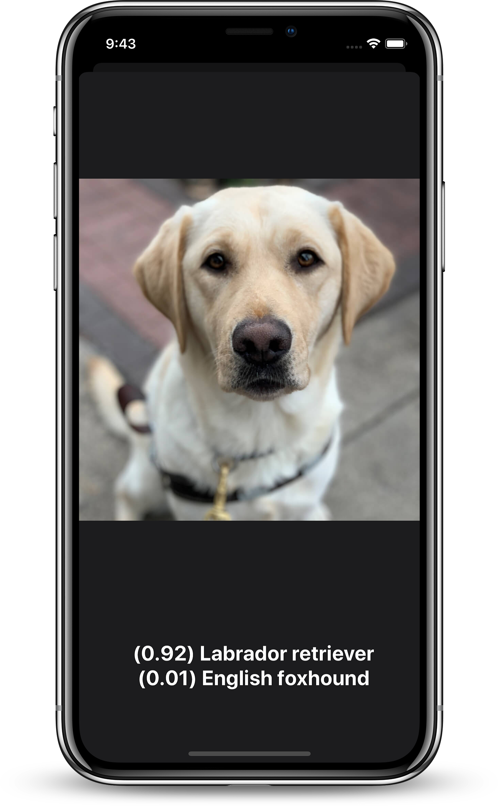

# CoreML-Object-Classifier


Object classification on iOS with CoreML Framework.


<p float="left">
    
    
    
</p>

## Requirements
- Xcode 11.3+
- iOS 13.0+
- Swift 5

## Model
 ResNet-50 https://github.com/KaimingHe/deep-residual-networks/blob/master/prototxt/ResNet-50-deploy.prototxt
 
## Model Convertion
1. Create the virtual env with conda:
```sh
$ conda create --name <name> python=2.7
$ conda activate <name>
$ conda install --file requirements.txt
```
2. Run the **script.py** script to do the conversion:
```sh
$ cd Convert
$ python2.7 script.py
``` 
This creates the Resnet50.mlmodel file.

3. Deactivate the env:
```
$ conda deactivate
```

